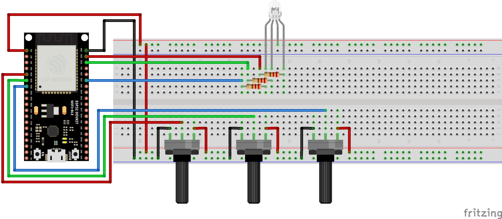

# RBG Selector
The RGB Selector project is an embedded system application designed to control the color of an RGB LED using three potentiometers. The project is implemented on an ESP32 microcontroller and utilizes the FreeRTOS operating system for task management.

This project could have been implemented without a microcontroller, but it served as a "test project" for me since it is my first project using microcntrollers and ESP-IDF framework.

### Features
- **LED Control**: Adjust the brightness of red, green, and blue channels of an RGB LED.
- **Analog Input**: Read analog values from three potentiometers to determine the LED color.
- **PWM Output**: Use PWM signals to control the LED brightness.

### Components
- **ESP32**: The microcontroller used for processing and control.
- **RGB LED**: The LED whose color is controlled by the system.
- **Potentiometers**: Three potentiometers used to adjust the red, green, and blue channels.
- **220 Ohm resistors**: One for each pin of the RGB LED to prevent damage to the LED.

### How It Works
1. **Setup**: Initialize the GPIO pins for the LED and configure the ADC for reading potentiometer values.
2. **Reading Values**: Continuously read the analog values from the potentiometers.
3. **Setting Color**: Convert the analog values to PWM duty cycles and update the LED color accordingly.

### Code Overview
- **setup()**: Configures the GPIO, PWM, and ADC settings.
- **Led_setColor()**: Sets the LED color based on the provided RGB values.
- **get_color()**: Reads the potentiometer values and converts them to RGB values.
- **app_main()**: Main application loop that continuously updates the LED color based on potentiometer readings.

This project demonstrates the use of FreeRTOS, ADC, and PWM on the ESP32 to create an interactive RGB LED controller.
